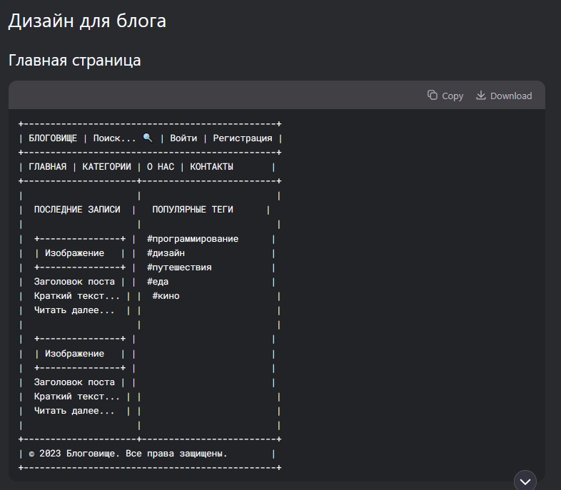
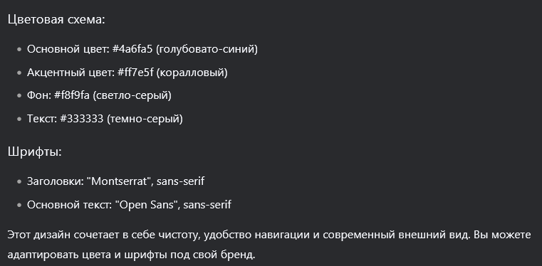

# Выпускной проект для Delfa и [моего портфолио](https://vseleyshiy.github.io/visitka/) - Сайт блог.

## Стеки: PHP, JavaScript, MySQL, HTML, CSS

# Старт

Нужен Composer. Надеюсь проблем с его установкой не будет - [click](https://getcomposer.org/download/)

Для AMPPS - Скачанный архив распаковать, лучше переименовать полученную папку в delblog (на всякий случай) и закинуть в www.
Перед использованием нужно поменять это под себя, чтобы развернуть проект:

- frontend/js/config/config.js
- backend/.env JWT_SECRET не менять - эти непонятные символы нужны для кодирования токена при авторизации.
- backend/utils/headers.php в строке Access-Control-Allow-Origin поставить свой url фронтенда

Так же нужно импортировать delblog.sql в свой PHPMyAdmin.

В консоли VS Code (ctrl + ё по дефолту вроде, чтобы открыть) пишем, находясь по пути (для AMPPS) www/delblog/:

```
cd backend
```

```
composer install
```

Таким образом мы установим нужные зависимости для бэкенда нашего проекта.

backend/vendor папку, backend/composer.json и backend/conposer.lock файлы - всё это трогать не нужно. Это как в Node JS папка node_modules и файлы package.json и package-lock.json. Там просто прописаны установленные зависимости для бэкенда в проект, а в backend/vendor они соответственно и находятся.

# Пароли

Данные от админки:

- email: a@a.com
- password: qwe123

Другой аккаунт обычного пользователя:

- email: u@u.com
- password: qwe123

# Функционал

- Главная страница со всеми постами, из которой можно добавить пост самому, если ты авторизирован.
- Админ панель, в которой можно отслеживать статистику сайта, добавлять и удалять посты от имени администратора.
- Интересная для такого уровня авторизация. Обычная регистрация. Минимальная валидация в виде проверки на пустоту
- Возможность просматривать отдельно каждый пост.
- Поиск постов из любого места при помощи специальной строки в header.

# Пару моих слов и моё мнение

Хороший мини-проект с интересной авторизацией. Адаптива нету, потому что нужно было сдать работу поскорее.

DeepSeek написал дизайн, а я перенёс его сюда. Дополнительно сделал добавление картинок (необязательно) и поиск постов.



Поиск написан тоже не просто от балды (может, только его дизайн) - он осуществляется при помощи debounce функции. При помощи неё запрос на сервер с текстом идёт только после истечения одной секунды после остановки написания в строку поиска (это можно увидеть в devtools -> network). Таким образом сервер нагружается меньше.

Не буду скрывать, где-то порой у меня долго грузился сайт, потому что Google Fonts грузились долго и JS-Cookie, установленные через cdn в файле frontend/components/scripts.php грузились тоже очень очень долго. Порой грузились долго и вообще не загружалось, потому что у меня был включен ВПН. Короче с этим есть маленькие проблемы, ведь просто так установить для html такие вот пакеты я не знаю как (например при Node JS устанавливается в node_modules, просто пишешь npm i js-cookie и у тебя локально всё установлено). Эта долгая загрузка - тоже проблема. Может быть где-то стоит как-то по другому что-то подключить или установить, но париться ради этого сейчас я не вижу смысла, но о проблеме знаю))

Получилось прикольно, можно было бы конечно где-то добить по фронтенду, но время сейчас важнее. В любом случае я считаю, что всё равно всё красиво и круто :)
